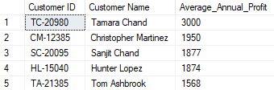
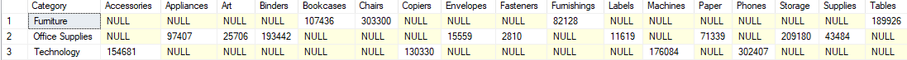
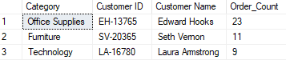
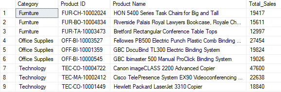
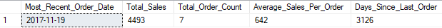

# 📊 SQL Server Customer & Sales Analytics
## Overview

This project demonstrates the application of SQL Server to solve real-world business analytics problems using retail sales data.

The analysis focuses on customer profitability, sales reporting, customer segmentation, product performance, and database programming. Throughout the project, returned orders are excluded from most analyses to focus on completed transactions that contributed to realized revenue and profit.

## 🎯 Project Objectives

The project answers the following business questions:

### 1. Customer Profitability Analysis
Identify the most profitable customers based on their average annual profit contribution.

### 2. Sales Reporting
Create category and sub-category sales reports using both static and dynamic pivoting techniques.

### 3. Customer Segmentation
Determine which customers place the highest number of completed orders within each product category.

### 4. Product Performance Analysis
Identify the top-performing products within each category based on sales.

### 5. Database Programming
Develop reusable SQL Server objects such as scalar functions and stored procedures for customer-level KPI retrieval.

## 🛠️ Skills Demonstrated
### SQL Fundamentals
  * Joins
  * Filtering
  * Aggregations
  * Group By

### Advanced SQL
  * Common Table Expressions (CTEs)
  * Window Functions
  * DENSE_RANK()
  * Dynamic SQL
  * PIVOT Operations

### Database Programming
  * Scalar User Defined Functions (UDFs)
  * Stored Procedures
  * Parameterized Queries

### Business Analytics
  * Customer Profitability Analysis
  * Product Performance Analysis
  * Customer Segmentation
  * Revenue Reporting

## 📂 Project Files
| File                                | Description                                |
| ----------------------------------- | ------------------------------------------ |
| `01_customer_lifetime_profit.sql`   | Top customers by average annual profit     |
| `02_sales_pivot_analysis.sql`       | Static and dynamic sales pivot reports     |
| `03_top_customers_by_category.sql`  | Highest-order customers by category        |
| `04_top_products_by_category.sql`   | Top-performing products by category        |
| `05_customer_details_procedure.sql` | UDF and stored procedure for customer KPIs |

## 📈 Project Walkthrough

### 1️⃣ Top Customers by Average Annual Profit
### Business Question
Who are the most profitable customers based on average annual profit generated from completed purchases?

### Concepts Used
 * CTEs
 * Aggregations
 * Date Functions
 * Customer Lifetime Value Analysis

📄 Query: [01_customer_lifetime_profit.sql](https://github.com/ArjunTheAnalyst/SQL_SERVER_CUSTOMER_AND_SALES_ANALYTICS/blob/main/01_customer_lifetime_profit.sql)

📷 Output

### 2️⃣ Sales Pivot Analysis
### Business Question
How are sales distributed across product categories and sub-categories?

### Concepts Used
 * Conditional Aggregation
 * Dynamic SQL
 * PIVOT
 * STRING_AGG

📄 Query: [02_sales_pivot_analysis.sql](https://github.com/ArjunTheAnalyst/SQL_SERVER_CUSTOMER_AND_SALES_ANALYTICS/blob/main/02_sales_pivot_analysis.sql)

📷 Output

### 3️⃣ Top Customers by Category
### Business Question
Which customers place the highest number of completed orders within each category?

### Concepts Used
 * Window Functions
 * DENSE_RANK()
 * Customer Segmentation

📄 Query: [03_top_customers_by_category.sql](https://github.com/ArjunTheAnalyst/SQL_SERVER_CUSTOMER_AND_SALES_ANALYTICS/blob/main/03_top_customers_by_category.sql)

📷 Output

### 4️⃣ Top Products by Category
### Business Question
Which products generate the highest sales within each category?

### Concepts Used
 * Window Functions
 * Ranking Functions
 * Product Analytics

📄 Query: [04_top_products_by_category.sql](https://github.com/ArjunTheAnalyst/SQL_SERVER_CUSTOMER_AND_SALES_ANALYTICS/blob/main/04_top_products_by_category.sql)

📷 Output

### 5️⃣ Customer Details Stored Procedure
## Business Question
How can customer-level KPIs be retrieved efficiently using reusable database objects?

### Metrics Returned
 * Most Recent Order Date
 * Total Sales
 * Total Orders
 * Average Sales Per Order
 * Days Since Last Order

### Concepts Used
 * Scalar Functions
 * Stored Procedures
 * Parameterized Queries

📄 Query: [05_customer_details_procedure.sql](https://github.com/ArjunTheAnalyst/SQL_SERVER_CUSTOMER_AND_SALES_ANALYTICS/blob/main/05_customer_details_procedure.sql)

📷 Output

## 📋 Business Assumptions
Returned orders are excluded from most analyses to focus on completed purchases that contributed to realized revenue and profit.

This approach mirrors common e-commerce reporting practices where customer value and product performance are evaluated using fulfilled transactions rather than gross order volume.

## 🚀 Key Takeaways
This project demonstrates the ability to:
 * Translate business requirements into SQL solutions
 * Build reusable database objects
 * Analyze customer profitability
 * Perform customer segmentation
 * Evaluate product performance
 * Create management-ready reports
 * Implement advanced SQL techniques such as dynamic pivoting and window functions
